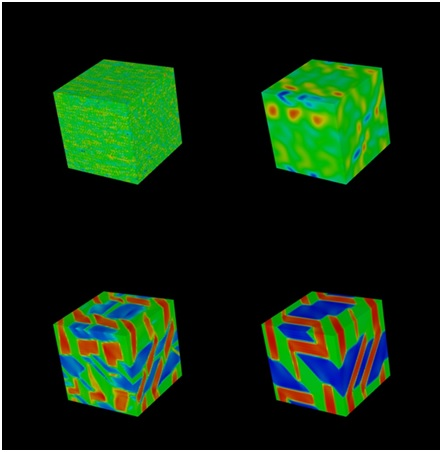

CoGL
====

Authors: Christopher Sewell (csewell@lanl.gov), Turab Lookman, and Kipton Barros
Version 1.0, September 2013
LA-UR-13-26956

Developed as part of the Exascale Co-Design Center for Materials in Extreme Environments
(http://exmatex.lanl.gov/), which is funded by the DoE office of Advanced Scientific Computing Research
(ASCR). Dr. Karen Pao is the program manager and Dr. William Harrod is the director of the ASCR
Research Division. Tim Germann and Jim Belak are the center director and deputy director. Allen
McPherson is the Computer Science Lead.

Copyright Notice
----------------

Copyright (c) 2013, Los Alamos National Security, LLC

All rights reserved.

Copyright 2013. Los Alamos National Security, LLC. This software was produced under U.S. Government
contract DE-AC52-06NA25396 for Los Alamos National Laboratory (LANL), which is operated by Los
Alamos National Security, LLC for the U.S. Department of Energy. The U.S. Government has rights to use,
reproduce, and distribute this software.

NEITHER THE GOVERNMENT NOR LOS ALAMOS NATIONAL SECURITY, LLC MAKES ANY WARRANTY,
EXPRESS OR IMPLIED, OR ASSUMES ANY LIABILITY FOR THE USE OF THIS SOFTWARE.

If software is modified to produce derivative works, such modified software should be clearly marked,
so as not to confuse it with the version available from LANL.
Additionally, redistribution and use in source and binary forms, with or without modification, are
permitted provided that the following conditions are met:

* Redistributions of source code must retain the above copyright notice, this list of conditions and the
following disclaimer.

* Redistributions in binary form must reproduce the above copyright notice, this list of conditions and
the following disclaimer in the documentation and/or other materials provided with the distribution.

* Neither the name of Los Alamos National Security, LLC, Los Alamos National Laboratory, LANL, the U.S.
Government, nor the names of its contributors may be used to endorse or promote products derived
from this software without specific prior written permission.

THIS SOFTWARE IS PROVIDED BY LOS ALAMOS NATIONAL SECURITY, LLC AND CONTRIBUTORS "AS IS"
AND ANY EXPRESS OR IMPLIED WARRANTIES, INCLUDING, BUT NOT LIMITED TO, THE IMPLIED
WARRANTIES OF MERCHANTABILITY AND FITNESS FOR A PARTICULAR PURPOSE ARE DISCLAIMED. IN
NO EVENT SHALL LOS ALAMOS NATIONAL SECURITY, LLC OR CONTRIBUTORS BE LIABLE FOR ANY DIRECT,
INDIRECT, INCIDENTAL, SPECIAL, EXEMPLARY, OR CONSEQUENTIAL DAMAGES (INCLUDING, BUT NOT
LIMITED TO, PROCUREMENT OF SUBSTITUTE GOODS OR SERVICES; LOSS OF USE, DATA, OR PROFITS; OR
BUSINESS INTERRUPTION) HOWEVER CAUSED AND ON ANY THEORY OF LIABILITY, WHETHER IN
CONTRACT, STRICT LIABILITY, OR TORT (INCLUDING NEGLIGENCE OR OTHERWISE) ARISING IN ANY WAY
OUT OF THE USE OF THIS SOFTWARE, EVEN IF ADVISED OF THE POSSIBILITY OF SUCH DAMAGE.

Description
-----------

CoGL is a stand-alone meso-scale simulation code used to analyze pattern formation in ferroelastic
materials using the Ginzburg–Landau approach. It models transitions from a face-centered cubic parent
phase to a body-centered tetragonal product phase due to either a rapid decrease in temperature or an
external deformation. By solving the force balance equations that use a nonlinear elastic free-energy
functional and also incorporate inertial and viscous forces, the strains are computed at each point on a
regular three-dimensional grid. The code allows the study of nucleation and growth of phase changes
on loading-unloading and heating-cooling protocols as a function of strain rates.

The simulation code itself is relatively short (a few hundred lines of code), consisting mainly of gradient
and Laplacian computations over the grid. Two versions of the code are included here: the original
serial Fortran code written by the domain scientists, and a data-parallel implementation using the
PISTON framework. PISTON is a portable, data-parallel framework developed at Los Alamos using
NVIDIA’s Thrust library. It allows an application developer to compile and run his/her code on different
parallel accelerator and multi-core architectures, making efficient use of the available parallelism on
each. This is accomplished by constraining the developer to writing algorithms using a limited set of
data-parallel primitives, each of which is efficiently implemented for each target architecture.
In the PISTON version of CoGL, the simulation is computed primarily using data-parallel transform
primitives, in which, for example, each thread computes the gradient at one grid cell. In an extended
version of this proxy app, not included here, more complex isosurface, threshold, and cut surface
visualization algorithms already implemented in PISTON can be applied to the strain field computed by
the simulation and rendered in-situ as the simulation is running.

Preliminary testing on a single node has shown that the PISTON implementation compiled to an
OpenMP backend and run on multiple cores scales well with the number of cores and outperforms the
equivalent serial C++ code and especially the original Fortran code. The PISTON implementation
compiled to a CUDA backend and run on a GPU improves parallel performance even further.
Furthermore, when the simulation is run on the GPU, rendering can be implemented with limited
additional performance cost because all the data can be kept on the card using CUDA’s interop feature.

This simulation was described in the following paper
(http://www.sciencedirect.com/science/article/pii/S1359645406000668):
Rajeev Ahluwalia, Turab Lookman, and Avadh Saxena. “Dynamic strain loading of cubic to tetragonal
martensites”, Acta Materialia, Volume 54, Issue 8, May 2006, Pages 2109-2120.

Instructions
------------

The dependencies are CUDA (https://developer.nvidia.com/cuda-downloads), which includes the Thrust
library; CMake (http://www.cmake.org/cmake/resources/software.html), for configuring the build;
OpenGL, GLEW, and GLUT (available with most package installers such as apt-get or yum); and PISTON
(https://github.com/losalamos/PISTON). Like Thrust, PISTON is only used through the inclusion of
header files, so there is no need to build anything in PISTON itself. CoGL has been tested on Linux and
Mac operating systems. PISTON-based programs have also been run on Windows machines, but CoGL
itself has not been tested on Windows, so it should be possible to get it to run on Windows, but may
take a little effort. We have in the past had some trouble installing GLEW on Macs, so the necessary
GLEW header and library for Mac are included in the mac subdirectory. See the end of this readme for
licensing notes about this redistribution. An NVIDIA GPU that supports CUDA with double-precision is
necessary to run the CUDA-based CoGL executable.

There are three executables that can be built. The original FORTRAN program written by the domain
scientists is in fortran subdirectory, and can be built using the Makefile in that directory, resulting in the
coglFOR executable. The other two executables, coglGPU (which uses the Thrust CUDA backend) and
coglOMP (which uses the Thrust OpenMP backend), can be built using the standard CMake build process
(http://www.cmake.org/cmake/help/runningcmake.html). The DATA_DIR CMake configuration path
should be set to the InitData directory within the CoGL directory, where files containing initial conditions
are included. The PISTON_DIR CMake configuration path should be set to the location where PISTON is
installed. Whether interop is used or not with coglGPU can be controlled using the ENABLE_INTEROP
CMake variable.

Running coglGPU or coglOMP without any command-line parameters will result in a GLUT window
launching, which will show a rendering of the cubical grid, colored according to the e2 deviatoric strain
value, along with numbers written to the console that can be used to validate correctness. The view
may be rotated using the left mouse button and zoomed using the right mouse button. It takes a few
thousand time steps before “interesting” things begin to happen. Running coglFOR will only output
these numbers, without any graphical output. Running coglGPU or coglOMP with a single command-line
argument that is an integer greater than zero will result in that many time steps being run and timed,
without any rendering. In order to run coglGPU in this render-free mode, interop must be disabled in
the CMake configuration.

It should be possible to build the OpenMP-based executable (coglOMP) on a system without CUDA. In
this case, it will be necessary to separately download the Thrust library
(http://code.google.com/p/thrust/downloads/list), and set THRUST_DIR in the CMake configuration to
point to its location (and set USE_CUDA to OFF). While this has been tested for some PISTON-based
programs, it has not been explicitly tested with CoGL, so please contact the authors directly if this does
not work.

Several parameters may be modified at the top of the CoGLSim.h file. On systems that are slow or have
a relatively small amount of memory on the CPU or GPU, it may be desirable to decrease the grid
dimension (DIM). One might experiment with uncommenting the #defines for PRECOMPUTE_INDICES,
OPTIMIZE_KERNEL_DIVISIONS, and/or OPTIMIZE_KERNEL_BRANCHES in order to compare performance
with these variations.

This release of CoGL is a somewhat simplified version which does not include additional visualization
operators, such as isosurface, threshold, and cut surface. It only renders each cell as a cube. Since only
the surface of the grid is visible, this can result in a lot of “wasted” rendering of interior cubes. If you are
interested in this version with the additional visualization operators, please contact the authors.

GLEW Redistribution Notes
-------------------------

From http://glew.sourceforge.net/glew.txt :

The OpenGL Extension Wrangler Library
Copyright (C) 2002-2008, Milan Ikits <milan ikits[]ieee org>
Copyright (C) 2002-2008, Marcelo E. Magallon <mmagallo[]debian org>
Copyright (C) 2002, Lev Povalahev

All rights reserved.

Redistribution and use in source and binary forms, with or without modification, are permitted provided
that the following conditions are met:
* Redistributions of source code must retain the above copyright notice, this list of conditions and the
following disclaimer.
* Redistributions in binary form must reproduce the above copyright notice, this list of conditions and
the following disclaimer in the documentation and/or other materials provided with the distribution.
* The name of the author may be used to endorse or promote products derived from this software
without specific prior written permission.

THIS SOFTWARE IS PROVIDED BY THE COPYRIGHT HOLDERS AND CONTRIBUTORS "AS IS" AND ANY
EXPRESS OR IMPLIED WARRANTIES, INCLUDING, BUT NOT LIMITED TO, THE IMPLIED WARRANTIES OF
MERCHANTABILITY AND FITNESS FOR A PARTICULAR PURPOSE ARE DISCLAIMED. IN NO EVENT SHALL
THE COPYRIGHT OWNER OR CONTRIBUTORS BE LIABLE FOR ANY DIRECT, INDIRECT, INCIDENTAL,
SPECIAL, EXEMPLARY, OR CONSEQUENTIAL DAMAGES (INCLUDING, BUT NOT LIMITED TO,
PROCUREMENT OF SUBSTITUTE GOODS OR SERVICES; LOSS OF USE, DATA, OR PROFITS; OR BUSINESS
INTERRUPTION) HOWEVER CAUSED AND ON ANY THEORY OF LIABILITY, WHETHER IN CONTRACT, STRICT
LIABILITY, OR TORT (INCLUDING NEGLIGENCE OR OTHERWISE) ARISING IN ANY WAY OUT OF THE USE OF
THIS SOFTWARE, EVEN IF ADVISED OF THE POSSIBILITY OF SUCH DAMAGE.

Sample frames
-------------

Four selected time steps (3000, 15,000, 25,000, and 200,000) from the CoGL simulation, plotting the grid
points colored according to the deviatoric strain value, showing how the strain field evolves when a
parent cubic lattice changes to a daughter tetragonal structure.

